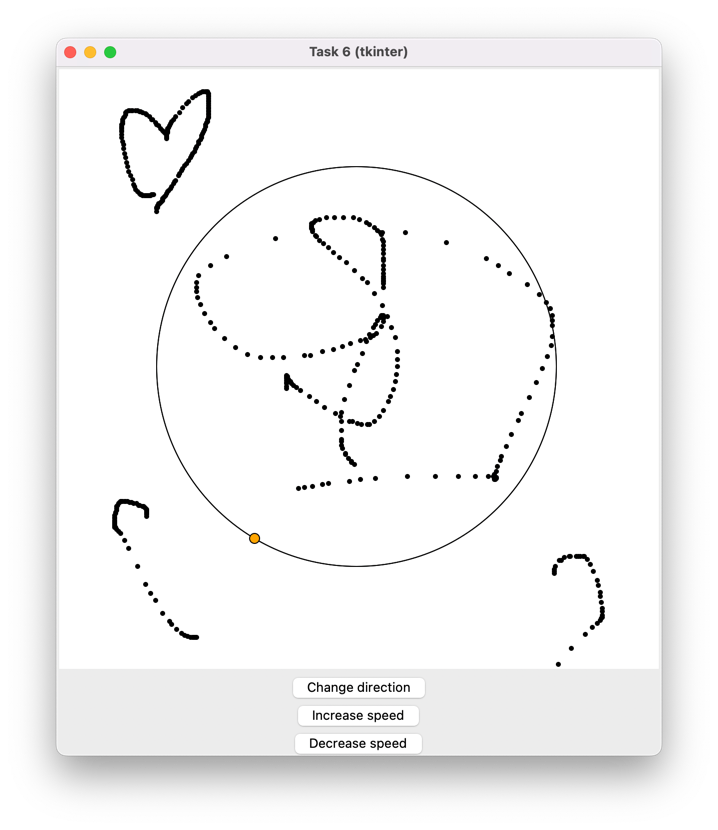

## Задание 6

С помощью класса __Canvas__ создадим холст размером 600х600. В магическом методе __init__ объявим переменные self.speed и self.direction для скорости и направления движения точки по окружности. С помощью метода __draw_circle__ отрисуем окружность с радиусом 200 по центру холста. Метод __draw_moving_point__ отвечает за создание движущейся по окружности точки: сначала вычисляем координаты движения точки с учетом заданного направления, далее удаляем точку после каждого перемещения. Уменьшаем переменную self.angle на произведение self.direction и self.speed, чтобы точка могла двигаться с заданной скоростью и направлением. Чтобы точка двигалась постоянно, функция self.draw_moving_point вызывает сама себя рекурсивно через каждые 10 миллисекунд с помощью self.root.after. Метод __draw_on_canvas__ позволяет нам рисовать на холсте: в event.x и event.y записываются координаты курсора, а create_oval создает черную точку при нажатии левой кнопки мыши.

Чтобы менять направление и скорость движения точки, добавим кнопки Increase speed, Decrease speed и Change direction с помощью метода add_buttons. Метод change_buttons_state отключает кнопки скорости и направления при достижении нуля. Метод show_message уведомляет об изменении состояния кнопок.

Результат выполнения программы:

